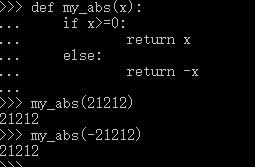

# 【Python】Python问题汇总
## 1.Python安装PIL报错：Could not find a version that satisfies the requirement PIL (from versions: )
起初安装命令是按照 `pip install PIL`来安装的

结果显示：`Could not find a version that satisfies the requirement PIL (from versions: )No matching distribution found for PIL`

错误原因：现在已经用`Pillow`代替`PIL`，`PIL`较多用于`2.7`版本的`Python`中

解决方法：
```python
pip install Pillow
```
## 2.Python-IndexError: list index out of range
对Python中有序序列进行按索引取值的时候，出现这个异常。

对于有序序列： 字符串 str 、列表 list 、元组 tuple进行按索引取值的时候，默认范围为 0 ~ len(有序序列)-1，计数从0开始，而不是从1开始，最后一位索引则为总长度减去1。当然也可以使用 负数表示从倒数第几个，计数从-1开始，则对于有序序列，总体范围为 -len(有序序列) ~ len(有序序列)-1，如果输入的取值结果不在这个范围内，则报这个错。

解决方法：检查索引是否在 -len(有序序列) ~ len(有序序列)-1 范围内，修改正确

例如：
```
name_list=['qfh','qff']
```
错误如下：
```
a=name_list[10]
```
正确如下：
```
a=name_list[0]
```

## 3.在交互环境中定义函数
需要在函数里敲`tab`空出缩进，结束函数可以敲两次回车


## 4.python TypeError: 'int' object is not iterable
报错
```
for index in len(numbers): 
```
`len(numbers)`返回的是`int`类型变量
不能直接对`int`类型变量进行迭代，而必须加个`range`。
对于数组的索引迭代，需要用到`len()`求数组的长度，用`range`进行索引迭代。