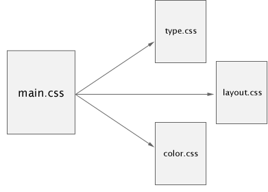

# CSS渐进增强
- 作者:Aaron gustafson2008年10月22日发表于《CSS, HTML, JavaScript》
- 原文地址：[Progressive Enhancement with CSS](https://alistapart.com/article/progressiveenhancementwithcss/)
在本系列的前一篇文章中，我们介绍了渐进增强的基本概念;现在，我们可以开始讨论如何使用它。有许多方法可以使用层叠样式表(Cascading Style Sheets, CSS)将渐进式增强集成到您的工作中，本文将讨论其中的一些重要问题，并让您考虑其他方法来逐步增强站点。

## 样式表组织
很多`web`设计人员和开发人员并没有考虑如何将样式表合并到他们的文档中，但是这是一种真正的艺术。使用正确的方法，您可以立即获得渐进增强的许多好处。

### 使用多个样式表
在你的`style`中有一些分离是有很多好处的。很明显，1500行的样式表很难维护，将它们分成多个样式表可以改进您的工作流(和您的完整性)。另一个不常被考虑的好处是，这种分离可以帮助您在目标媒体类型之间获得更大的一致性。

考虑使用`main.css`文件，该文件包含站点的所有样式规则，并将其分解为包含排版、布局和颜色信息的单个样式表。相应地命名文件:`type.css`、`layout.css`和`color.css`。

如何将单个样式表划分为多个上下文样式表。

一旦你做到了这一点，你就可以使用一些小技巧来自动为旧的浏览器(如Internet Explorer 5/Mac)和许多其他对`CSS`布局缺乏坚实支持的浏览器提供“低保真”体验。如何?这取决于你如何链接到这些文件。让我们假设我们从`main.css`文件开始，通过一个`link`元素包含:

```html
<link rel="stylesheet" type="text/css" href="main.css" />
```
首先，我们将它分为三个独立的调用我们的上下文样式表:
```html
<link rel="stylesheet" type="text/css" href="type.css" />
<link rel="stylesheet" type="text/css" href="layout.css" />
<link rel="stylesheet" type="text/css" href="color.css" />
```
在过去，我们许多人利用“`screen,projection`”的`media`价值来摧毁`Netscape 4.x`得到布局样式，但有更好的方法。不过，在查看解决方案之前，让我们考虑一下替代媒体类型。

### 使用替代媒体类型
由于内容交付是渐进式增强的主要关注点，我们希望向任何支持它的设备交付“增强的”体验，因此我们应该真正开始考虑浏览器之外的东西;最重要的是，我们应该考虑印刷和移动。

不幸的是，移动市场仍然是碎片化和不成熟的(不要让我开始在所有的手持浏览器上，他们认为他们应该呈现针对“屏幕”的`media`类型的样式)。因此，以渐进增强的方式讨论处理该媒介的来由需要几篇文章，如果不是一整本书的话。但不要绝望:在移动世界中，事情开始变得越来越好，一些非常聪明的人开始聚集资源来帮助你。但出于时间和集体理智的考虑，我们将把重点放在印刷上。

现在，通常，我们会添加打印样式与另一个链接元素:
```html
<link rel="stylesheet" type="text/css" media="print" 
href="print.css" />
```
传统上，这个样式表将包含所有与打印相关的规则，包括排版和颜色规则。特别是在排版方面，我们的打印样式表中的规则很可能反映了我们的主样式表中的规则。换句话说，我们有很多重复。

这就是排版样式和颜色样式与布局样式分离的好处:我们不再需要在打印样式表中使用这些规则。最重要的是，我们可以使用另一种组织技术来提高站点的可伸缩性，并在有问题的浏览器中隐藏某些布局样式。

让我们从重新访问样式表开始。考虑以下:
```html
<link rel="stylesheet" type="text/css" href="type.css" />
<link rel="stylesheet" type="text/css" href="layout.css" />
<link rel="stylesheet" type="text/css" href="color.css" />
```
现在，由于我们没有声明媒体类型，`Netscape 4.x`将读取这三个文件中的任何样式，但是我们可以使用它对`CSS`的基本理解，并通过将`layout.css`中包含的所有样式移动到一个新样式表中来进一步组织我们的样式规则，适当命名的`screen.css`。最后，我们更新`layout.css`的内容来导入`screen.css`和`NS4.x`和它的同类不会更聪明(因为他们不理解@import指令)。
```css
@import 'screen.css';
```
但是仍然有一些改进的空间—我们应该声明这个样式表是用于哪个媒体的，我们将通过在@import声明中添加一个媒体类型来做到这一点:
```css
@import 'screen.css' screen;
```
问题是`IE7`及以下版本不理解这种语法，并且会忽略样式表，但是如果您也想为这些浏览器提供这些样式(您可能会这样做)，那么使用条件注释就可以很容易地做到这一点，我们将在下面讨论。具有敏锐眼光的读者可能已经注意到，在样式表名称周围使用单引号(')而不是双引号(")。这是一个让`IE5/Mac`忽略样式表的小技巧。由于`IE5/Mac`的`CSS`布局相当粗糙(特别是在浮动和定位方面)，隐藏布局规则是一种完全可以接受的处理方式。毕竟，它仍然会获得颜色和排版信息，这很重要。

使用相同的技术，我们可以导入我们的`print.css`文件(它包含，您猜对了，特定于`print-layout`的规则)。
```css
@import 'screen.css' screen;
@import 'print.css' print;
```
现在，我们不仅已经很好地组织了样式表，而且还有一种有效的方法来逐步增强站点的设计。