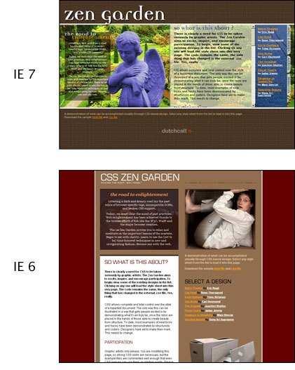
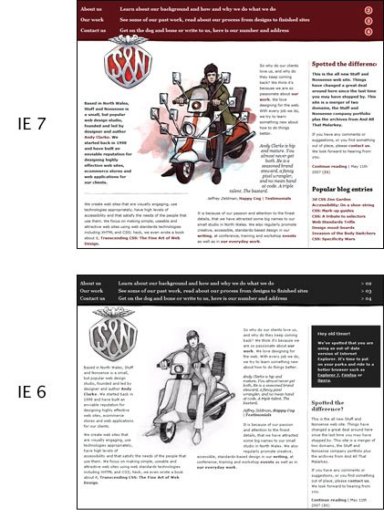

# 【译】CSS渐进增强
- 作者:Aaron gustafson2008年10月22日发表于《CSS, HTML, JavaScript》
- 原文地址：[Progressive Enhancement with CSS](https://alistapart.com/article/progressiveenhancementwithcss/)
在本系列的前一篇文章中，我们介绍了渐进增强的基本概念;现在，我们可以开始讨论如何使用它。有许多方法可以使用层叠样式表(Cascading Style Sheets, CSS)将渐进式增强集成到您的工作中，本文将讨论其中的一些重要问题，并让您考虑其他方法来逐步增强站点。

## 样式表组织
很多`web`设计人员和开发人员并没有考虑如何将样式表合并到他们的文档中，但是这是一种真正的艺术。使用正确的方法，您可以立即获得渐进增强的许多好处。

### 使用多个样式表
在你的`style`中有一些分离是有很多好处的。很明显，1500行的样式表很难维护，将它们分成多个样式表可以改进您的工作流(和您的完整性)。另一个不常被考虑的好处是，这种分离可以帮助您在目标媒体类型之间获得更大的一致性。

考虑使用`main.css`文件，该文件包含站点的所有样式规则，并将其分解为包含排版、布局和颜色信息的单个样式表。相应地命名文件:`type.css`、`layout.css`和`color.css`。

如何将单个样式表划分为多个上下文样式表。

一旦你做到了这一点，你就可以使用一些小技巧来自动为旧的浏览器(如Internet Explorer 5/Mac)和许多其他对`CSS`布局缺乏坚实支持的浏览器提供“低保真”体验。如何?这取决于你如何链接到这些文件。让我们假设我们从`main.css`文件开始，通过一个`link`元素包含:

```html
<link rel="stylesheet" type="text/css" href="main.css" />
```
首先，我们将它分为三个独立的调用我们的上下文样式表:
```html
<link rel="stylesheet" type="text/css" href="type.css" />
<link rel="stylesheet" type="text/css" href="layout.css" />
<link rel="stylesheet" type="text/css" href="color.css" />
```
在过去，我们许多人利用“`screen,projection`”的`media`价值来摧毁`Netscape 4.x`得到布局样式，但有更好的方法。不过，在查看解决方案之前，让我们考虑一下替代媒体类型。

### 使用替代媒体类型
由于内容交付是渐进式增强的主要关注点，我们希望向任何支持它的设备交付“增强的”体验，因此我们应该真正开始考虑浏览器之外的东西;最重要的是，我们应该考虑印刷和移动。

不幸的是，移动市场仍然是碎片化和不成熟的(不要让我开始在所有的手持浏览器上，他们认为他们应该呈现针对“屏幕”的`media`类型的样式)。因此，以渐进增强的方式讨论处理该媒介的来由需要几篇文章，如果不是一整本书的话。但不要绝望:在移动世界中，事情开始变得越来越好，一些非常聪明的人开始聚集资源来帮助你。但出于时间和集体理智的考虑，我们将把重点放在印刷上。

现在，通常，我们会添加打印样式与另一个链接元素:
```html
<link rel="stylesheet" type="text/css" media="print" 
href="print.css" />
```
传统上，这个样式表将包含所有与打印相关的规则，包括排版和颜色规则。特别是在排版方面，我们的打印样式表中的规则很可能反映了我们的主样式表中的规则。换句话说，我们有很多重复。

这就是排版样式和颜色样式与布局样式分离的好处:我们不再需要在打印样式表中使用这些规则。最重要的是，我们可以使用另一种组织技术来提高站点的可伸缩性，并在有问题的浏览器中隐藏某些布局样式。

让我们从重新访问样式表开始。考虑以下:
```html
<link rel="stylesheet" type="text/css" href="type.css" />
<link rel="stylesheet" type="text/css" href="layout.css" />
<link rel="stylesheet" type="text/css" href="color.css" />
```
现在，由于我们没有声明媒体类型，`Netscape 4.x`将读取这三个文件中的任何样式，但是我们可以使用它对`CSS`的基本理解，并通过将`layout.css`中包含的所有样式移动到一个新样式表中来进一步组织我们的样式规则，适当命名的`screen.css`。最后，我们更新`layout.css`的内容来导入`screen.css`和`NS4.x`和它的同类不会更聪明(因为他们不理解@import指令)。
```css
@import 'screen.css';
```
但是仍然有一些改进的空间—我们应该声明这个样式表是用于哪个媒体的，我们将通过在@import声明中添加一个媒体类型来做到这一点:
```css
@import 'screen.css' screen;
```
问题是`IE7`及以下版本不理解这种语法，并且会忽略样式表，但是如果您也想为这些浏览器提供这些样式(您可能会这样做)，那么使用条件注释就可以很容易地做到这一点，我们将在下面讨论。具有敏锐眼光的读者可能已经注意到，在样式表名称周围使用单引号(')而不是双引号(")。这是一个让`IE5/Mac`忽略样式表的小技巧。由于`IE5/Mac`的`CSS`布局相当粗糙(特别是在浮动和定位方面)，隐藏布局规则是一种完全可以接受的处理方式。毕竟，它仍然会获得颜色和排版信息，这很重要。

使用相同的技术，我们可以导入我们的`print.css`文件(它包含，您猜对了，特定于`print-layout`的规则)。
```css
@import 'screen.css' screen;
@import 'print.css' print;
```
现在，我们不仅已经很好地组织了样式表，而且还有一种有效的方法来逐步增强站点的设计。

## 现在，让我们来回答这个价值1000万美元的问题:我们如何应对IE6?
对许多人来说，Internet Explorer 6就是网景公司的新产品——人人都希望它消失。

我们将跳过IE6中的一系列问题;它的问题都有详细的文档记录，而且老实说，解决起来也不是那么困难。

此外，IE7的普及尤其迅速(尤其是在消费者市场)，IE8已经处于测试阶段，这意味着有一天，我们可能真的能够告别老龄化。

无论是否是有意为之，微软在发布IE5时提供了一个支持渐进式增强的强大工具:条件注释。
这些巧妙的逻辑(在所有其他浏览器中退化为HTML注释)不仅允许我们将某些标记指向IE，还允许我们将它们指向特定版本的IE。

作为了解web标准的开发人员，我们应该总是从在最兼容标准的浏览器中测试我们的设计开始，然后为那些只需要一点提示就能让它们走上正轨的浏览器提供修复程序。每个人的工作流程都不同，但我发现最好是用一组标准的文件来开始每个项目。我的基本集包括以下内容:
- type.css
- layout.css
- screen.css
- print.css
- color.css

然后，根据项目的需求，我添加了包含`nudges`的特定于浏览器的`CSS`文件。在当前的大多数项目中，它们是`ie7.css`和`ie6.css`，如果项目要求支持一个`IE6`以及之前的版本，我将创建一个对应的文件，以及一个`ie5.5.css`等等)。有了这些文件之后，我开始将样式规则添加到基本集合中适用的样式表中。

我在`Mozilla Firefox`中开始所有的`CSS`测试，因为我的大部分`CSS`都是用它的`Edit CSS`工具条编写的。一旦我在`Firefox`中完成了页面设计，我就会启动其他浏览器来查看。
大多数人在摸索web标准的过程中表现得天衣无缝。然后转到`IE7`。在大多数情况下，我没有发现很多问题，但偶尔需要调用`hasLayout`或修复另一个小的布局错误。我没有将这些修改添加到我的基本样式表集合中，而是将它们添加到`ie7.css`中，然后将该文件链接到文档头部的一个条件注释中:
```html
<!--[if lte IE 7]>
<link rel="stylesheet" type="text/css" href="ie7.css" />
<![endif]-->
```
该条件注释将特定的样式表指向任何小于或等于(lte) 7的IE版本。因此，如果有人访问IE7的这个页面，他们将得到我在其中应用的修复程序，但是如果他们进入一个更新的版本—可能已经修复了那些渲染问题，就像`IE8`废除了`haslayout`一样—样式表将被忽略。另一方面，如果有人使用IE6访问这个页面，他们将从这个样式表获得修复，这是完美的，因为`IE7`中出现的任何呈现错误都可能在`IE6`中出现。一个这样的修正是通过在`ie7.css`的顶部添加一个`screen.css`的`@import`来弥补`IE`在(版本7及以下)理解媒体类型`@import`(如上所述)方面的缺陷，而无需声明一个媒体类型，因此可以导入第一次没有导入的样式。

一旦我完成了对`IE7`的修复，我就会打开`IE6`，看看它是否也需要一些帮助。如果是这样，我就在文档中添加另一个条件注释，链接到`ie6.css`。

```html
<!--[if lte IE 7]>
<link rel="stylesheet" type="text/css" href="ie7.css" />

<link rel="stylesheet" type="text/css" href="ie6.css" />
<![endif]-->
```

然后，我简单地将IE6所需的修复添加到那个样式表中，它们将被IE7忽略，但仍然会向下延伸到IE5.5.5，等等。

以这种方式使用条件注释允许您轻松地管理您的项目所需的浏览器，并保持您的CSS文件不受攻击。

## 其他考量
CSS中的渐进增强并不局限于如何将样式表与文档关联起来:我们还可以将这个概念应用于如何编写CSS。

例如，考虑生成的内容。并不是所有的浏览器都能处理它，但这是一种添加额外的设计或文本的好方法，这些设计或文本对页面的可用性来说不是必需的，但提供了一些视觉或其他增强。

例如，以这个简单的联系方式为例:


本例中使用的HTML表单(下面提供了代码)。

在编写此代码时，您可能会忍不住将冒号(:)放在label元素中。为什么?他们在标签上加了什么吗?不。虽然它们有一定的用途，为用户提供额外的视觉提示，但它们对于标签来说是多余的，应该去掉(Line wrap marked ? -Ed):
```html
<form id="contact-form" method="post">
  <fieldset>
    <legend>Contact Us
    <p>Send us a message. All fields are required.</p>
<ol>
    <li>
        <label for="contact-name">Name</label>
        <input type="text" id="contact-name" name="name" />
      </li>    <li>
        <label for="contact-email">Email</label>
        <input type="text" id="contact-email" name="email" />
      </li>
    <li><label for="contact-message">Message</label>
        <textarea id="contact-message" name="message" rows="4" »
        cols="30"></textarea>
      </li>
    </ol>
    <button type="submit">Send It</button>  </fieldset>
</form>
```
生成的内容是将它们添加回文档的完美合适的方式:
```html
label:after {
  content: ":";
}
```
以这种方式处理表单使我们可以灵活地从整个站点中删除这些修饰，只需编辑CSS，而不必触及每个表单(是的，我曾经遇到过这种情况)。
这种技术也可以很好地退化，因为没有这些柱体，表单就不是无用的——这是渐进增强的一个完美例子。

您可能还会发现，使用更高级的选择器编写规则可以帮助您通过将某些样式定向到更高级的浏览器来逐步增强站点。
一个很好的例子是属性选择器，它不被IE6及其早期版本所理解(因此被忽略)。`Egor Kloos`在他提交给`CSS Zen Garden`的名为`Gemination`的设计中完美地运用了这个概念。



比较`Egor Kloos`的`CSS Zen Garden`条目(`Gemination`)在支持标准的浏览器和`IE6`中的显示。

他是怎么做到的?下面是他的代码中的一个稍微修改过的采样:
```css
/* <= IE 6 */
body {
  margin: 0;
  text-align: center;
  background: #600 none;
}/* IE 7, Mozilla, Safari, Opera */
body[id=css-zen-garden] {
  margin: 100px 0 0;
  padding: 0;
  text-align: center;
  background: transparent url(squidback.gif);
}
```
这些差异非常明显，并且很好地说明了渐进式增强是如何在您的`CSS`中实现的。

类似地，`Andy Clarke`在他的站点上对`IE6`也有一点乐趣。通过使用`IE`中可用的过滤器和一些有条件的评论，他能够从他的网站上去掉所有的颜色，并提供一些替代图像，以获得真正的“低保真”体验。



比较安迪克拉克的网站在标准浏览器和IE6。

通过使用条件注释将下列声明块添加到针对IE6(及其下)的样式表中，可以实现图像灰度化:
```css
/* =img for Internet Explorer < 6 */
img {
  filter: gray;
}
```
虽然这两个例子包含的技巧可能比您在日常工作中所能掌握的更多，但是它们确实可以作为您使用CSS进行渐进式增强的概念验证。